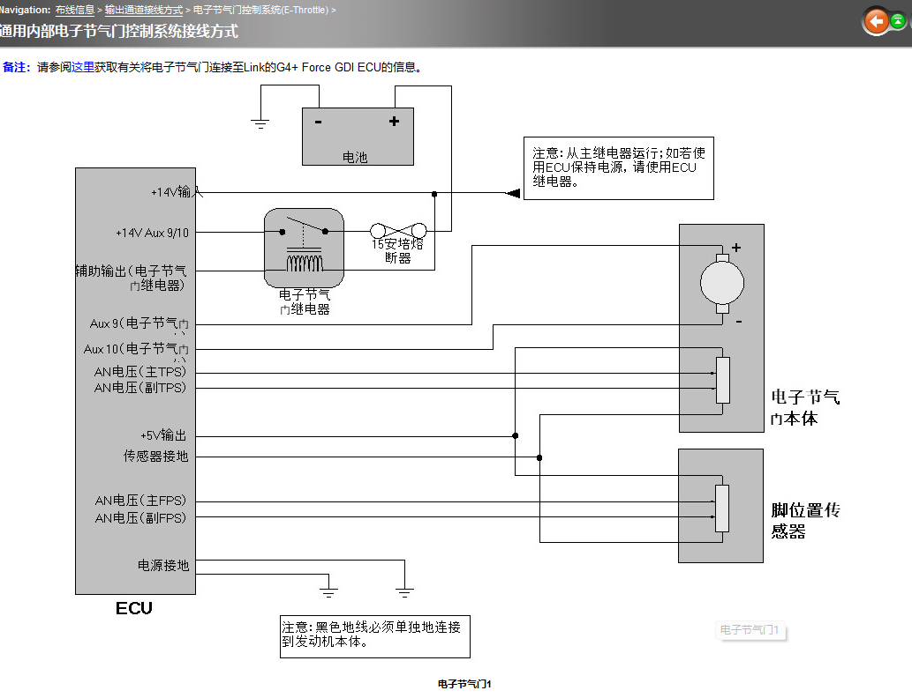
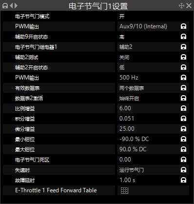
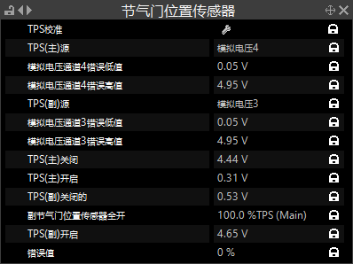
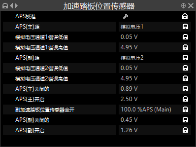
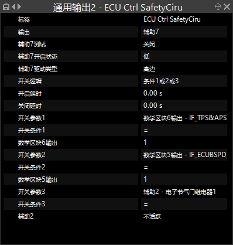
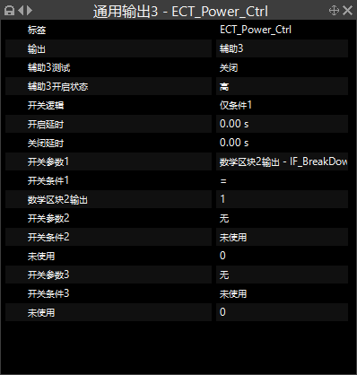
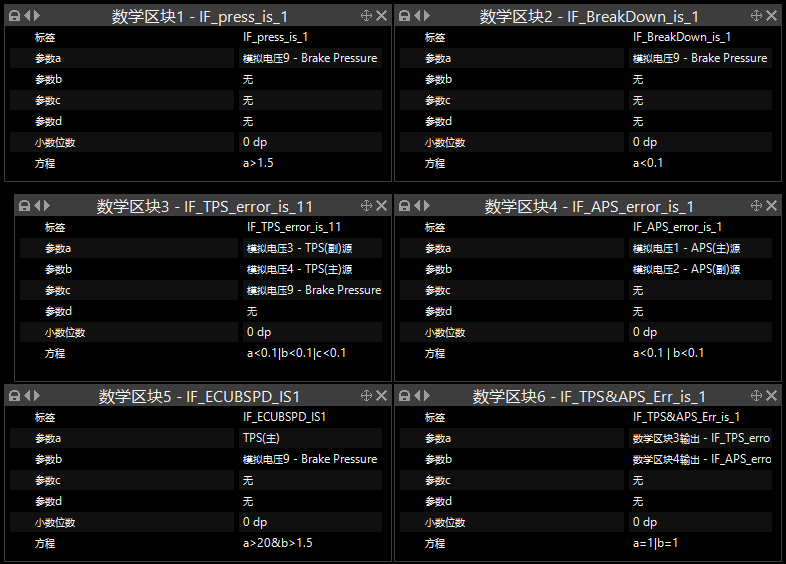
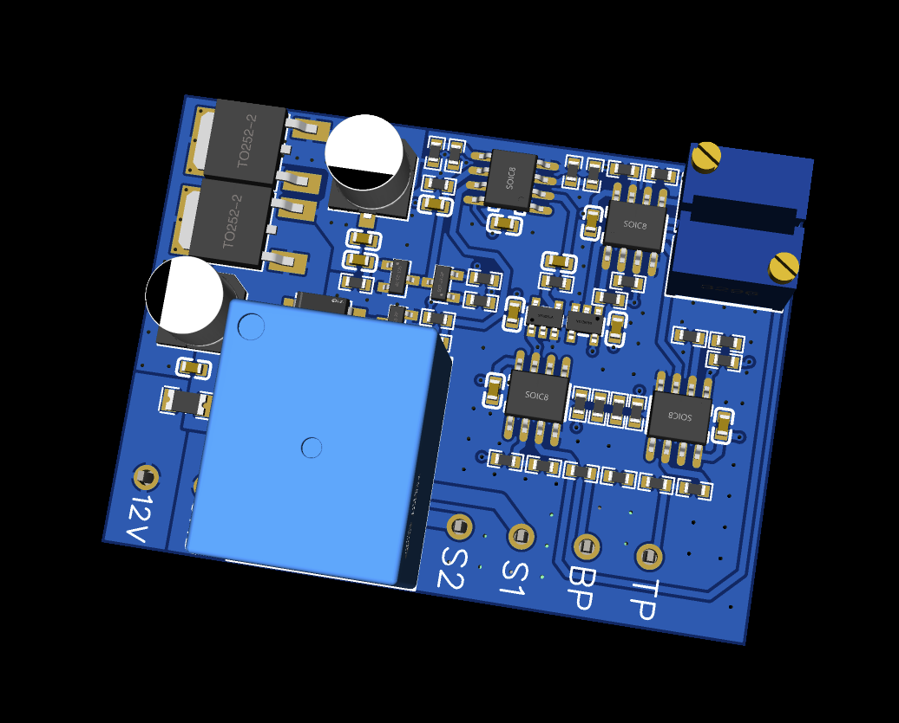

# ECT-BSPD_HQU_CZCD

华侨大学承志赛车队电控电子节气门规则及自制BSPD工程

## 0、电子节气门

使用电子节气门 需要一个油门踏板传感器 我们使用的是 ***客车电子油门踏板GFS004N-D*** 这款传感器内部便存在满足规则的 ***“独立供电 独立信号”*** 而且价格也还能接受仅需 ***108RMB*** ;
还需要一个电子节气门（废话）
电子节气门和油门踏板传感器仅需安照帮助文档中的电路图接线，在此处设置对应通道，然后分别校准即可，link的帮助文档讲解的很详细


## 1、电子节气门过检相关内容

### 全车继电器分配

* 本队采用了两个继电器串联控制安全回路，一个继电器由全车3个急停开关、惯性开关、制动超程开关、BSPD进行控制；还有一个继电器由ECU进行控制。只有当两个继电器全部吸合时，整车安全回路才会闭合，喷油点火继电器被激活。油泵的继电器得到电源输入。
* 针对电子节气门，除了ECU本身需要的一个电源控制继电器，由于此继电器无法接受用户的自定义控制，我们还增加了一个继电器串入电子节气门电源用于用户控制电子节气门电源。
* 因此全车一共7个继电器 1、喷油/点火；2、油泵；3、风扇；4、安全回路；5、ECU控制安全回路；6、电子节气门电源；7、用户控制电子节气门电源

### 继电器控制逻辑

通过查看ECU文件的数字区块及辅助输出控制可以知晓本队的过检流程及控制逻辑

* ***数字区块*** 为LINK ECU 的逻辑控制部分，可以自定义输入参数，并设置公式，当满足某些条件时，输出一个bool信号 即0或者1；类似于编程语言中的 if 条件语句
* ***辅助输出*** 为LINK ECU 的输出端口 一般用于继电器的控制，LINK ECU提供了 3个可供选择的参数输入，可以供用户设定 当对应参数等于或大于或小于某个值时 触发相应继电器

#### 通用输出2 ECU Ctrl SafetyCiru

本辅助输出控制ECU安全回路继电器，由数字区块5、6 及电子节气门电源状态控制
当数字区块5或6被触发或电子节气门电源不活跃时关闭此继电器，达到关闭安全回路的目的。

* ***数字区块5*** 输入参数为***TPS值***与***制动压力***，当制动压力电压大于1.5V TPS大于20 时触发
* ***数字区块6*** 输入参数为 ***数字区块3***和***数字区块4*** 任意一个数字区块触发则触发数字区块6 而数字区块3和4分别为tps 和 aps 的电压检测，当任意一个tps信号或aps信号丢失时，这些数字区块会被触发；因此数字区块6可以称为tps aps信号检测 任意信号丢失则触发数字区块6
* ***电子节气门电源状态*** ECU内部存在一些保证电子节气门安全的逻辑，如当tps无法达到期望值，即tps与目标值不符时间超出错误阈值，ECU会自行关闭电子节气门电源，又如当两个tps信号或者aps信号存在较大差值时，ECU也会自行关闭电子节气门电源，这一判断条件就是保证，当上述情况发生时，整车的安全回路会被断开，喷油点火油泵电源会被断开

#### 通用输出3 ECT Power Ctrl


本辅助输出控制用户自行添加的电子节气门电源继电器，主要针对制动信号丢失后对电子节气门的相关控制，即，当制动压力信号低于0.1V（一般正常值为1V）时，认为制动压力信号丢失，此时控制此继电器关闭电子节气门电源


## 

#### 以上为本队完善电子节气门相关规则使用到的相关逻辑

#### 由于相关文件含有其他组成员的劳动成果 故仅在此分享达成逻辑

#### 通过本队的过检流程，我们发现除了LINK ECU 本身存在的一些安全逻辑，我们只需针对制动压力补充相关程序逻辑，增加一些线束，使ECU控制某些特定的回路即可完成所有过检流程。分享此文件出来希望能帮助到想要使用，计划使用电子节气门的车队

## 2、[BSPD_Project](https://github.com/Saturday-365/ECT-BSPD_HQU_CZCD/tree/main/BSPD_Project)

此PCB文件为自制的嘉立创EDA工程文件，本设计的降压部分采用两个LDO并联输出，以期望减小稳压芯片发热量以增强整个模块的稳定性，测试过程中发现并联ldo仍然存在发热量较大的情况，下一版本考虑测量一下此模块工作时电流大小，根据模块电流需求，重新设计DCDC降压电路，以继续增强模块的稳定性；
其他相关部分均符合规则所说的 *“一个独立的非编程电路” 及 “独立定义为：在这一块印刷电路板上，没有额外的功能被应用”* 本自制模块以经过2025赛季检验。欢迎各家车队参考，自制的成本很低，买次一物料至少能焊出来3-4块。（目前这版本调节两个信号的两个电位器无丝印标识也无顺逆时针对应增加减少标识 后续会考虑增加，另外，在下一版本中可以考虑增加一路信号输入，两路制动压力输入以完善整个BSPD系统）


## 3、致谢

## 感谢 ***HUQ-13*** ***HQU-14*** 车组成员 感谢***林哥 泉哥 保罗 嘉辉*** 为以上内容做出的贡献，感谢他们对我的帮助，感谢他们对HQU承志做出的贡献

## 4、 本队的电控换挡也已开源欢迎各位参考指点

### ***麻烦各位点点star🌟🌟🌟***

### [华侨大学承志赛车队 25赛季 电控换档 E-Shift-CZCD](https://github.com/Saturday-365/E-Shift-CZCD)

<!-- 
#### 四级标题  
##### 五级标题  
###### 六级标题 
二、编辑基本语法  
1、字体格式强调
 我们可以使用下面的方式给我们的文本添加强调的效果
*强调*  (示例：斜体)  
 _强调_  (示例：斜体)  
**加重强调**  (示例：粗体)  
 __加重强调__ (示例：粗体)  
***特别强调*** (示例：粗斜体)  
___特别强调___  (示例：粗斜体)  
2、代码  
`<hello world>`  
3、代码块高亮  
```
@Override
protected void onDestroy() {
    EventBus.getDefault().unregister(this);
    super.onDestroy();
}
```  
4、表格 （建议在表格前空一行，否则可能影响表格无法显示）
 
 表头  | 表头  | 表头
 ---- | ----- | ------  
 单元格内容  | 单元格内容 | 单元格内容 
 单元格内容  | 单元格内容 | 单元格内容  
 
5、其他引用
图片  

链接  
[链接名称](https://www.baidu.com/)  
6、列表 
1. 项目1  
2. 项目2  
3. 项目3  
   * 项目1 （一个*号会显示为一个黑点，注意⚠️有空格，否则直接显示为*项目1） 
   * 项目2   
 
7、换行（建议直接在前一行后面补两个空格）
直接回车不能换行，  
可以在上一行文本后面补两个空格，  
这样下一行的文本就换行了。
或者就是在两行文本直接加一个空行。
也能实现换行效果，不过这个行间距有点大。  
 
8、引用
> 第一行引用文字  
> 第二行引用文字  
———————————————— -->
